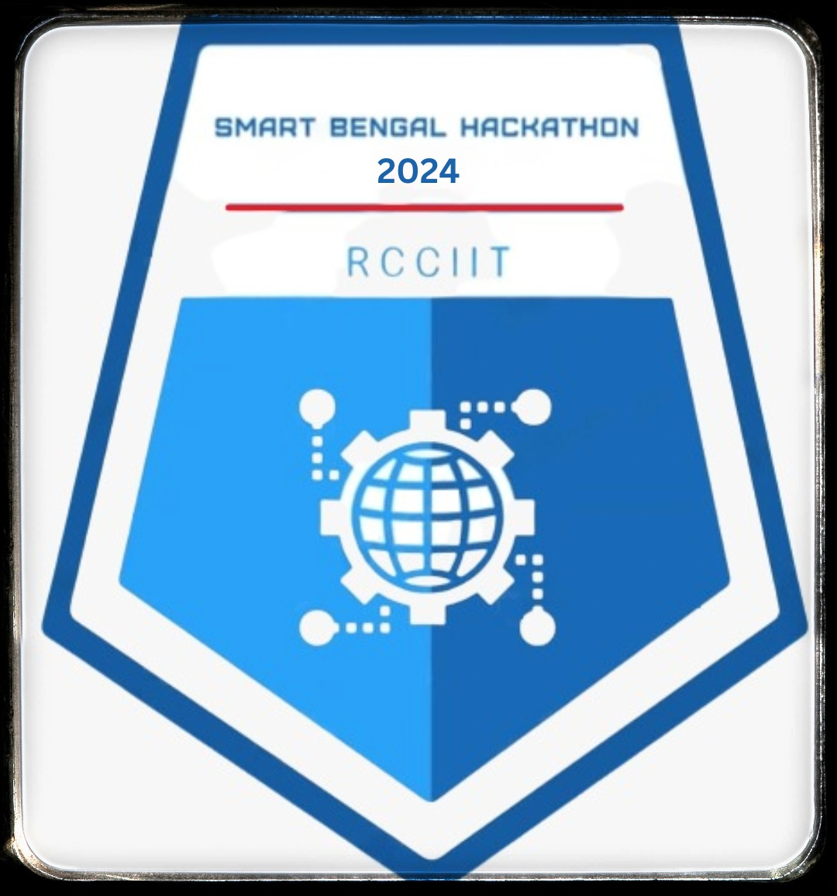

<!-- Profile Banner -->

  

<!-- Introduction -->
<h1 align="center" >I'm Srijon Deyasin</h1>

  Aspiring Java & J2EE Developer | CSE pre final | Tech Enthusiast  

---

### 🚀 About Me  
- 🔭 Currently working on **Java Web Development (JSP, Servlets, JDBC)**  
- 🎯 Aiming to become a **Full-Stack Java Developer**  
- 💡 Learning **Servlets JSP, DSA, and Problem-Solving**  
- ⚡ Fun Fact: I love **gaming & reading non-fictional books, tech vlogs, articles!**  

---

  
  

---

### Languages

### Tools

### Databases

### Frameworks

---

### Hackathon Participation  

  
  

---

### Connect With Me  

  
  
  
  

